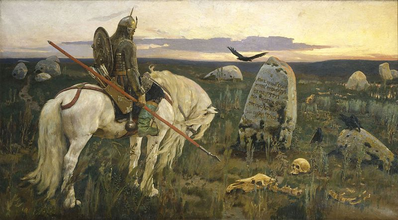

# Creating a character

Roll 3d6 for each of your Ability scores:

* **Strength**
* **Dexterity**
* **Will**

You may choose to swap two of these scores.

Roll 1d6 for your Hit points (HP).

HP is a measure of your character’s ability to avoid life-threatening wounds.

Roll 1d100 to determine how many Schillings you have.

Roll on the starting equipment table.

The starting equipment table should vary based on your setting. There is an example table below.

# Starting Equipment Table

|     | 1 HP                                                                    | 2 HP                                                               | 3 HP                                                                    | 4 HP                                                           | 5 HP                                                                      | 6 HP                                                                   |
|-----|-------------------------------------------------------------------------|--------------------------------------------------------------------|-------------------------------------------------------------------------|----------------------------------------------------------------|---------------------------------------------------------------------------|------------------------------------------------------------------------|
| 3-9 | Saber (d6) Musket (d8) Arcanum 3 Bombs (2d12) Walking Stick             | Rapier (d4) Hatchet (d8) Arcanum Pliers Caltrops                   | Musket (d8) Pistol (d6) Arcanum 3 Bombs (2d12) Pick Axe     | Hatchet (d6) Shortsword (d6) Pliers Grease                     | Machete (d6) Bow and Arrow (d6) Walking Stick Deck of Cards | Great Sword (d8) Blunderbuss (d10) Sewing Needle  |
| 10  | Musket (d8)  Shortsword (d6) Arcanum  Weapon Repair Kit    | Pistol (d6) Bow and Arrow (d6) Arcanum Lock Pick         | Hatchet (d6) Great Sword (d8) Arcanum  Weapon Repair Kit          | Dagger (d6) Bayonette (d6) Grappling Hook            | Pistol (d6) Hatchet (d6) Crowbar Compact Mirror                           | Concealable Pistol (d6) Musket (d8) Pick Axe 10 Schillings             |
| 11  | Blunderbuss (d10) 1 Stick of Dynamite (3d6) Arcanum Acid Compact Mirror | Maul (d8) Throwing Axe (d6) Arcanum Lock Pick Caltrops             | Dagger (d6) Net  Arcanum Weapon Repair Kit                              | Rapier (d4) Pistol (d6) Grease Armor (1)                       | Club (d6) Bow and Arrow (d6) Chisel 2 sticks of Dynamite (3d6)            | Glaive (d6) Throwing Knives (d4) Caltrops Weapons Repair Kit           |
| 12  | Axe (d6) Whip (d4) Arcanum Pick Axe 10 Schillings                       | Spear (d6) Pistol (d6) Iron Spikes Crowbar                         | Halberd (d8) Pistol (d6) Shovel Armor (2)                               | Pistol (d6) Maul (d8) 3 bombs (2d12) Grease                    | Saber (d6) Shortsword (d6) Lock Pick Caltrops                             | Machete (d6) Musket (d8) Shovel Sewing Needle                          |
| 13  | Shortsword (d6) Pistol (d6) Arcanum Acid Armor (2)                      | Great Sword (d8) Hatchet (d6) Chisel Acid                          | Bow and Arrow (d6) Rapier (d4) Grappling Hook Lock Pick                 | Halberd (d8) Bayonet (d6) Pick Axe Spyglass                    | Musket (d8) Shortsword (d6) Weapon Repair Kit Cigarettes                  | Wood Staff (d6) Dagger (d6)H Hammer 2 Sticks of Dynamite (3d6)         |
| 14  | Dagger (d6) Musket (d8) Arcanum Pick Axe 3 flashbangs                   | Bow and Arrow (d6) Grappling Hook Spyglass Pliers                  | Throwing Axe (d6) Halberd (d8) Armor (1) Crowbar                        | Club (d6) Hatchet (d6) Armor (2) Cigarettes                    | Club (d6) Blunderbuss (d10) Weapon Repair Kit Caltrops                    | Great Sword (d8) Pistol (d6) Sewing Needle 2 Sticks of Dynamite (2d12) |
| 15  | Spear (d6) Axe (d8) 10 Schillings 3 bombs (2d12)                        | Club (d6) Shortsword (d6) 1 Stick of Dynamite (3d6) Grappling Hook | Machete (d6) Hatchet (d6) Shovel Caltrops                               | Great Sword (d8) Bayonet (d6) Grappling Hook Weapon Repair Kit | Axe (d6) Saber (d6) 2 sticks of dynamite (2d12) Pick Axe                  | Great Sword (d8) Bow and Arrow (d6) 10 Schillings 1 bomb (2d12)        |
| 16  | Saber (d6) Bow and Arrow (d6) Armor(1) Dice  1 flashbang                | Dagger (d6) Dagger (d6) Lock Pick 10 Schillings                    | Maul (d8) Saber (d6) Armor(1) Crowbar                                   | Shortsword (d6) Pistol (d6) Weapon Repair Kit Spyglass         | Bow and Arrow (d6) Rapier (d4) Armor(2) Lock Pick                         | Hatchet (d6) Wood Staff (d6) Caltrops 10 Schillings                    |
| 17  | Halberd (d8) Musket (d8) Armor(2) Pick Axe                              | Spear (d6) Concealable Pistol (d6) Chisel Compact Mirror           | Axe (d6) Throwing Knives (d4) 2 Sticks of Dynamite (3d6) Chain and Lock | Throwing Axe (d6) Throwing Knives (d4) Iron Spikes 1 flashbang | Wood Staff (d6) Net  10 Schillings Chain and Lock                         | Musket (d8) Pistol (d6) Poison Darts (d4) Cigarettes                   |
| 18  | Bayonet (d6) Musket (d8) 3 sticks of dynamite (3d6) Weapon Repair Kit   | Dagger (d6) Hatchet (d6) Dice Iron Spikes                          | Club (d6) Pistol (d6) Crowbar Weapon Repair Kit                         | Rapier (d4) 1 stick of dynamite (3d6) Chisel Weapon Repair Kit | Pistol (d6) Throwing Knives (d4) Shovel Caltrops                          | Wood Staff (d6) Hatchet (d4) Shovel Caltrops                           |

# Character advancement

Characters gain Experience (XP) by surviving encounters and interacting with the world.

* **1 XP**: A simple encounter with minor damage
* **2 XP**: A difficult encounter with moderate damage but no fatalities
* **3 XP**: A dangerous encounter with a fatality or permanent consequences
* **4 XP**: A deadly encounter with multiple fatalities, massive damage, or harrowing retreat

Complex interactions with NPCs, especially if they are accompanied by difficult choices, should also provide XP. Finding a teacher or patron can be another source XP.

When you gain enough XP to Advance, roll a d20 for each ability score. If the roll is greater than your score, raise it by 1, to a maximum of 18.

Characters advance along the following schedule.

* **Level 1** : 5 XP
* **Level 2**: 10 XP
* **Level 3**: 20 XP
* **Level 4**: 40 XP
* **Level 5**: 80 XP

XP is not cumalative. Everytime a character Advances to the next level their XP count returns to 0.

At each Advancement, choose an Advancement skill. Each Advancement skill includes a hit die. Roll this die and add it to your maximum HP, to a maximum of 20.

You’ll want to create Advancement skills specific to your setting, but here are some examples. At each Advancement, choose one of the below. Each Advancement includes a hit die. Roll this die and add it to your maximum HP, to a maximum of 20.

