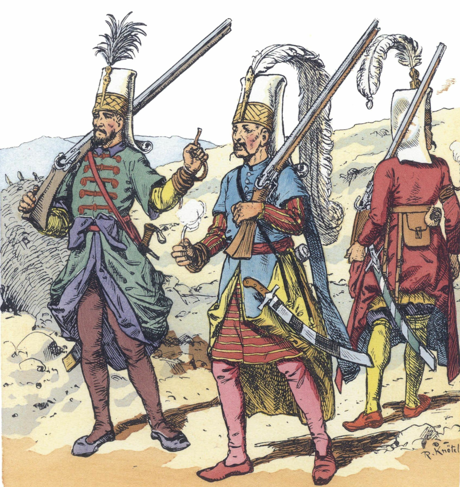

{width=60%}

 

If you’re gonna play D&D, you need rules to give structure to the game. For veteran players, these rules will look familiar. For new folks, D&D and all it’s spinoffs follow a common structure. The Referee (classically, game or dungeon master) describes a situation. A player describes how they want to respond and act. If there is uncertainty or danger involved in the player’s decision, dice are rolled to determine how things play out. Then, the process repeats.

The specifics involved vary widely among different systems, and nearly every Referee has their own version of “the rules” that they run. These are the rules that I like, and I hope there’s something in here useful for you at your table.

I’m calling these “core rules” because they form the basis of every game that I run. Depending on the setting, there are often additional rules that govern things like classes, exploration, and loot.

This page contains the mechanical rules that describe how the game operates. For rules about creating and leveling up Characters, head to this page

 
# Turns

On your Turn, you can move and perform an action. Turns should move in some established order around the table.

In combat, the Referee describes what the enemy is about to do and asks each player what they would like to do in response. All rolls are made and the combat round is resolved simultaneously.
Saves

When you find yourself in danger, the Referee may call for a Save. Roll one d20. If you roll under or equal to the appropriate Ability score, you pass the Save.

# Attacks

Attack actions always succeed. Roll your weapon damage die and subtract the target’s armor. Attacks that are Impaired in some way roll 2 damage dice and take the lowest. Attacks that are Enhanced in some way roll 2 damage dice and take the highest. Using two one-handed weapons grants Enhanced attacks.
Damage and armor

Damage is subtracted from your Hit points (HP). Armor reduces damage by its number. After HP is exhausted, damage is subtracted from the Strength score. If the target takes Strength Damage, it must pass a Strength Save or become Wounded.

# Wounded

A Wounded Character is incapacitated and unable to take actions for d4 rounds or until revived by an ally. Every time a Character takes Strength damage they must make a Strength Save or become Wounded.

At 0 Strength a Character is dead.

At 0 Dexterity a Character is paralyzed until they have a full rest.

At 0 Will a Character is comatose until they have a full rest.

# Arcana

Use an action to activate or otherwise use an Arcanum. If using the Arcanum in a way not described, make a Will save.

# Firearms

After firing, you must spend 1 full Turn reloading before you fire again. You cannot move or perform other actions while reloading. If you roll a 1 on your damage roll, your gun has malfunctioned and must be repaired before use. This requires a weapon repair kit or a visit to a gunsmith.

# Spell casting

To cast a spell with your action, make a Will save. Spells always work, but if you fail the save you take 1d4 Will damage. If you roll a 4, then you suffer a random affliction.

# Random encounters

Every 20 minutes in a dungeon (2 rounds), when entering a new space, or when there is a loud commotion, the Referee rolls 1d6. On a 1, an encounter from that location’s table occurs. Random encounters need not always be dangers or threats.

# Supply

When adventuring in the world, each player turn costs 1 “Supply”, an abstracted way to keep track of food and other resources. 1 person can hold 20 Supply, and these can be tracked with a d20 die in front of that player. At the end of their turn, the player decrements their Supply d20.

A player may carry more than 20 Supply, at the cost of 1 Strength point per extra 10 Supply. Pack animals can carry 200 Supply. If the players forget how many Supply the animal is carrying, that animal is considered to have run away or otherwise disappeared.

If the players are in darkness, each turn costs 2 Supply. Using an item or tool (shovel, antitoxin) costs an extra Supply each turn the item is being used. A player need not explicitly have the item in their inventory to use it, the exception being weapons and items sold at merchants.

Retreating or retracing ground already covered costs 0 Supply, unless a random encounter occurs.

If a player runs out of Supply, all their rolls are Impaired. They will not be able to see in the dark, and they lose 1 HP per turn. A player without Supply cannot rest.

# Morale

Most enemies will not simply flight until dead, especially groups of enemies. If a group of enemies loses roughly 1/2 of their number, they must pass a collective Will save. If they fail, they will flee or otherwise change their tactics. Lone combatants should roll this save when they reach 0 HP.

# Resting

Short rest: 10 minutes (1 turn) of rest recovers all of a Character’s lost HP.
Full rest: After a full night of restful sleep, restore d6 points to each ability score, up to that score’s maximum.

# Luck roll

When things are uncertain the Referee can make a Luck roll.

Roll 1d6. On a low roll, fortune does not favor the players. On a high roll, fortune favors the players.
A note on HP

Narrating combat in a way that is both cinematic and plausible is a challenging aspect of playing the Referee. This is my recommendation for narrating combat with this system.

Think of HP as a measure of the Character’s stamina and ability to avoid injury. Over the course of an encounter, the two sides are eroding the enemies ability to evade injury and continue fighting. At HP 0, you begin describing the real physical damage being inflicted to the Character’s Strength score.

If your players are fighting a werewolf, and it inflicts 1 point of damage to a Character with 10 HP, then the Character was able to smoothly avoid the attack without trouble. In contrast, if the werewolf inflicts 8 points of damage to the 10 HP Character, then the Character is barely fending off the beast.

A great narration of the 8 points of damage would be something like, “the werewolf tackles you, slamming you into the forest floor and knocking the wind out of you. With the butt of your gun you’re managing to keep its fangs from tearing into you, but you’re hard pressed to keep it up.”
Example random encounter table

# Example random encounter table

Roll	Event
1	Minotaur: HP 25, Armor 3, Great Axe d12
The Minotaur knows the tunnels inside and out.
2	Psychedelic moss:
3	Escaped prisoners:
4	Goblin exploratory party:
5	
6	Loot

| Roll | Event | 
|:---------:|:-----:|
| 1  | Minotaur: HP 25, Armor 3, Great Axe d12. The Minotaur knows the tunnels inside and out. |
| 2   | Psychedilic moss:  |
| 3     | Escaped prisoners:  |
| 4     | Goblin exploratory party:              |
| 5      |   Shackled prisoner:        |
| 6     | Loot    |

: {tbl-colwidths="[25,75]"}

# Sources

The text on this page is drawing heavily from the Into the Odd [SRD](https://www.bastionland.com/2020/11/mark-of-odd-licence-and-srd.html).  

In accordance with that SRD, all credit for that content due to [Chris McDowall](www.bastionland.com), the original and brilliant creator of Into the Odd.

The idea of Turns, as well as Supply, are heavily inspired by Hankerin Furinale's [Index Card RPG](https://www.runehammer.online/online-store/Index-Card-RPG-Master-Edition-PDF-p495157491)

